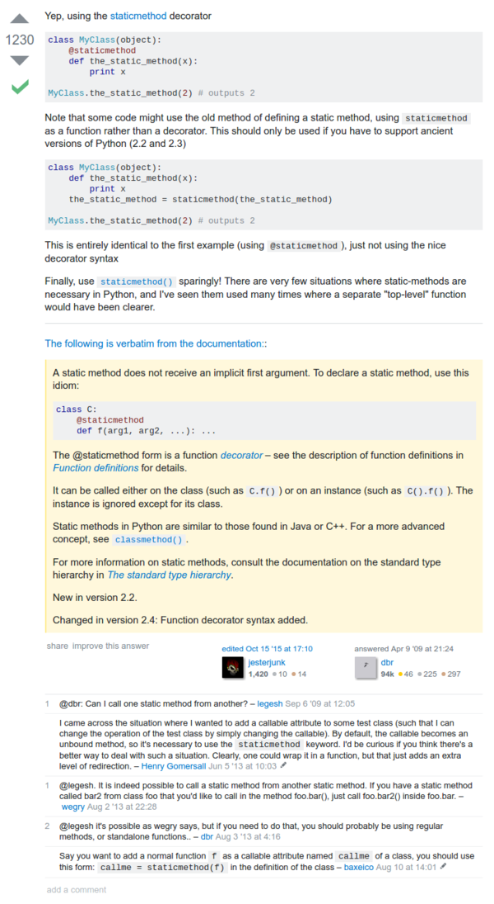

* Here is an example on how to make a method static in Python, [http://stackoverflow.com/questions/735975/static-methods-in-python](http://stackoverflow.com/questions/735975/static-methods-in-python).
* Basically I need to put `@staticmethod` before function/method declaration.

