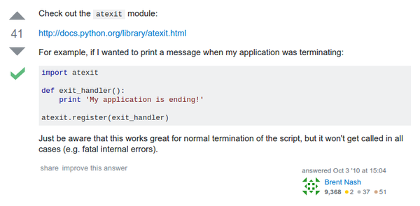

* Using `atexit` library if you want your Python codes to execute something on exit, [http://stackoverflow.com/questions/3850261/doing-something-before-program-exit](http://stackoverflow.com/questions/3850261/doing-something-before-program-exit).
* However, `atexit` does not work when the program exit abnormally.

