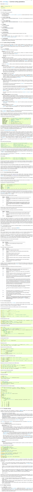

* This is a good thing to remember, Python documentation for string formatting, [https://docs.python.org/3/library/string.html](https://docs.python.org/3/library/string.html). Specifically look at how to format string example.
* Python has one of the best string manipulation out of other programming languages that I have ever tried.

