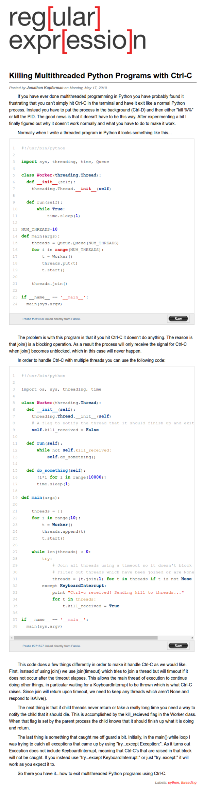

* I was using this, [http://www.regexprn.com/2010/05/killing-multithreaded-python-programs.html](http://www.regexprn.com/2010/05/killing-multithreaded-python-programs.html), tutorial to guide me on closing multi threaded Python script. It sorta works. Perhaps, this tutorial does not work fully on my case because my thread was intended to run forever.
* This is the full screenhot of the tutorial.

