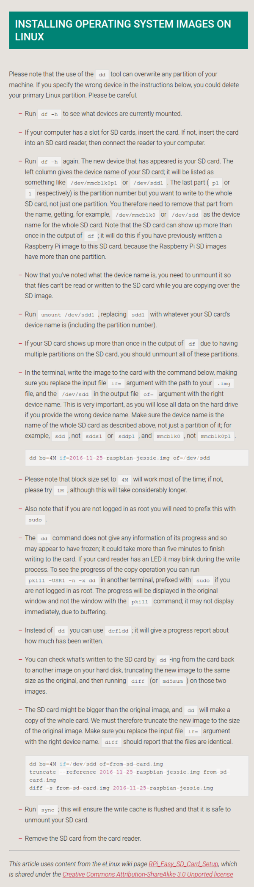

* Here is an official guide from Raspberry PI on how to format partition using CLI application in Linux with `dd` and `df` command, [https://www.raspberrypi.org/documentation/installation/installing-images/linux.md](https://www.raspberrypi.org/documentation/installation/installing-images/linux.md).
* Here is the screenshot of the guide.

