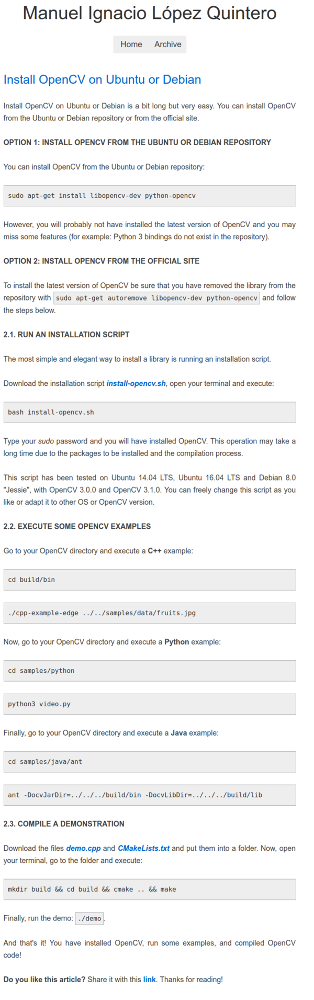

* Guide on installing OpenCV in Ubuntu or Debian, [http://docs.opencv.org/3.0-beta/doc/py_tutorials/py_gui/py_image_display/py_image_display.html#write-an-image](http://docs.opencv.org/3.0-beta/doc/py_tutorials/py_gui/py_image_display/py_image_display.html#write-an-image).

