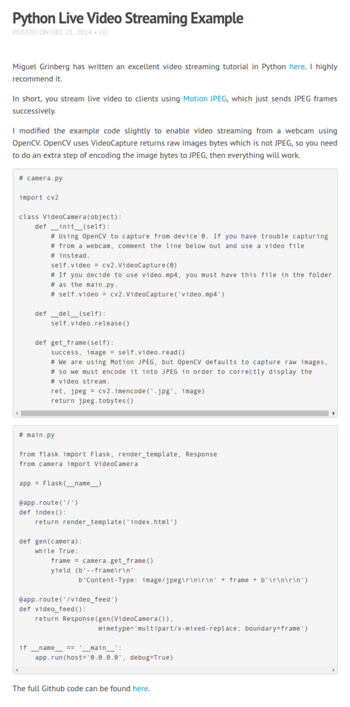

* Here is a simple guide on making video streaming web application using Python, [http://www.chioka.in/python-live-video-streaming-example/](http://www.chioka.in/python-live-video-streaming-example/).
* The guide uses a method called motion JPG. It means that instead of streaming video it stream loose .jpg files regularly.
* This method works better in high latency environment, hence, this is also the method that most of security cams also uses.

