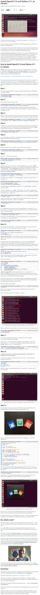

* There is another guide on how to install OpenCV in Ubuntu Linux, [http://www.pyimagesearch.com/2015/06/22/install-opencv-3-0-and-python-2-7-on-ubuntu/](http://www.pyimagesearch.com/2015/06/22/install-opencv-3-0-and-python-2-7-on-ubuntu/).
* All in all, I prefer to install everything via `pip` package manager.
* If possible, it is also preferable to install Python package in virtual environment. However, I am not sure if I can access web cam and other hardware like microphone from Python code in virtual environment.

