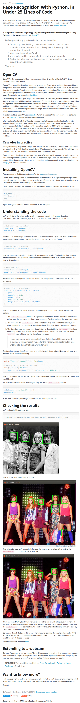

* Another Python face recognition tutorial with only 25 lines of codes, [https://realpython.com/blog/python/face-recognition-with-python/](https://realpython.com/blog/python/face-recognition-with-python/).

