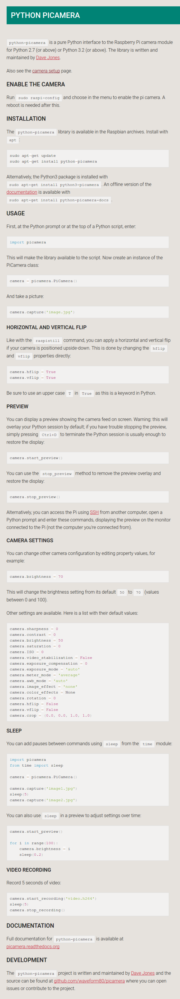

*  Official guide Python library of web camera for Raspberry PI, [https://www.raspberrypi.org/documentation/usage/camera/python/README.md](https://www.raspberrypi.org/documentation/usage/camera/python/README.md).

