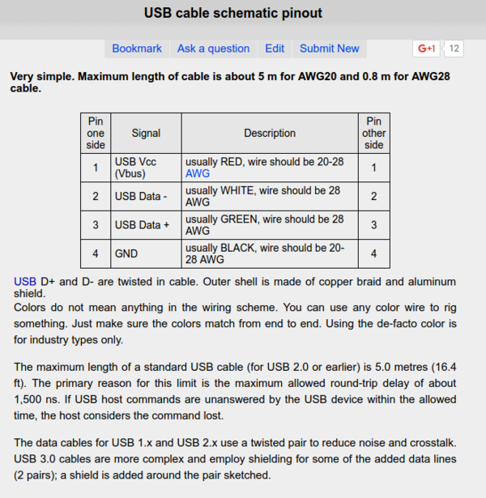
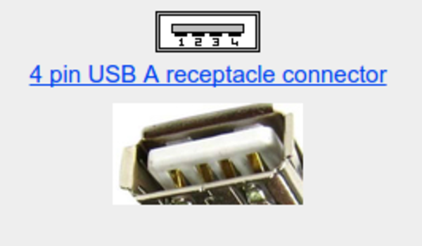
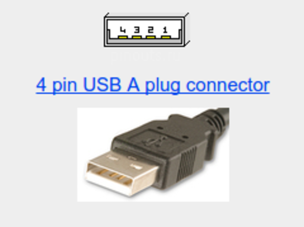
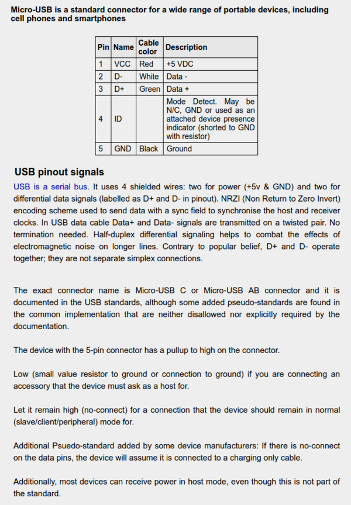
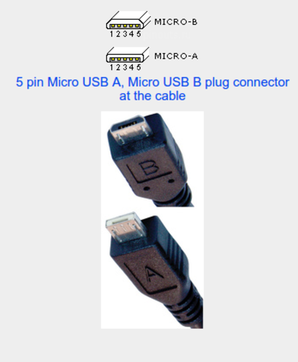
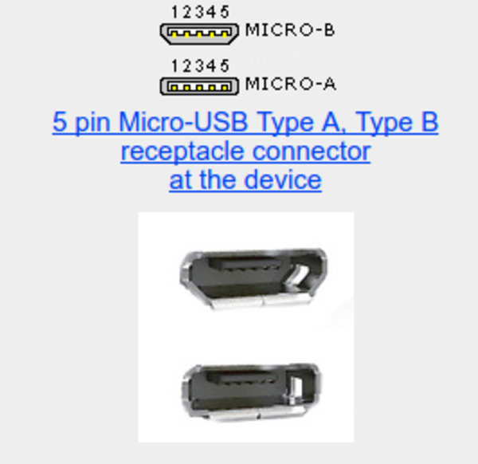

* Some USB sockets pinouts mapping.
    * [http://pinoutguide.com/SerialPortsCables/usb_cable_pinout.shtml](http://pinoutguide.com/SerialPortsCables/usb_cable_pinout.shtml)
    * [http://pinouts.ru/PortableDevices/micro_usb_pinout.shtml](http://pinouts.ru/PortableDevices/micro_usb_pinout.shtml)
* Screenshot of the articles.

