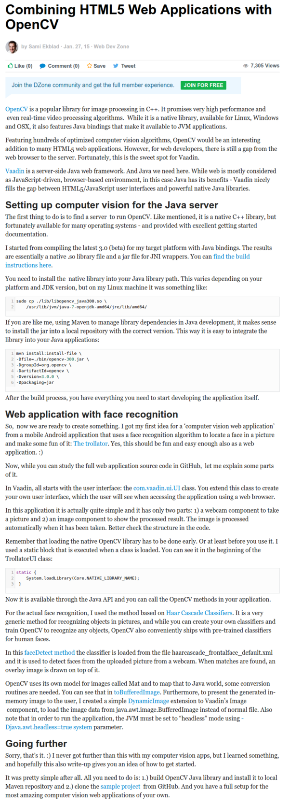

* Here is a general idea on how to implement OpenCV application in a Java based server.
* So here is mentioned that I can actually do OpenCV processing within a web application made using Java, [https://dzone.com/articles/combining-html-web](https://dzone.com/articles/combining-html-web).
* Sadly the article was very thin line and does not dive into the technical part.
* Below is the screenshot of the article.

