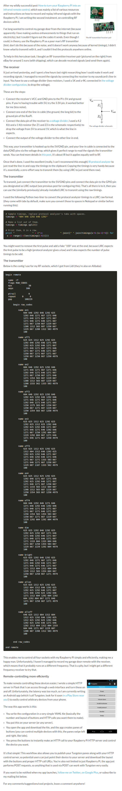

* Tutorial on how to interface RF communication with Raspberry PI, [https://www.stavros.io/posts/how-remote-control-rf-devices-raspberry-pi/](https://www.stavros.io/posts/how-remote-control-rf-devices-raspberry-pi/).
* Full screenshot.

