* There is this blog post in Hackaday about making emergency battery for your Raspberry PI, [http://hackaday.com/2016/03/17/battery-backup-for-the-raspberry-pi/](http://hackaday.com/2016/03/17/battery-backup-for-the-raspberry-pi/).
* Here is the full screenshot of the article.

* Here are some images of the backup battery for the Raspberry PI.

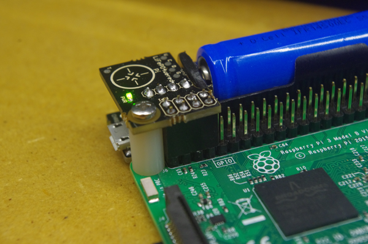

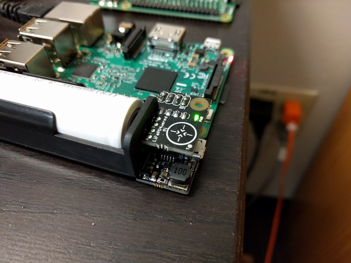

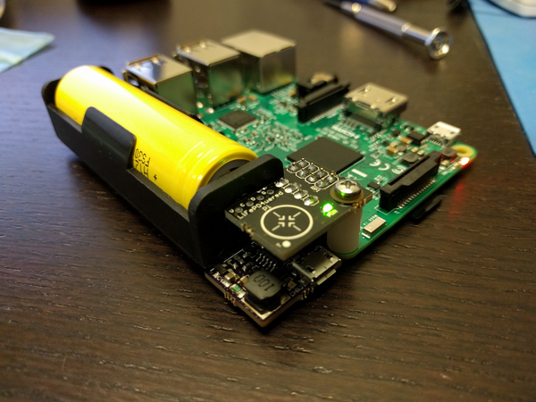

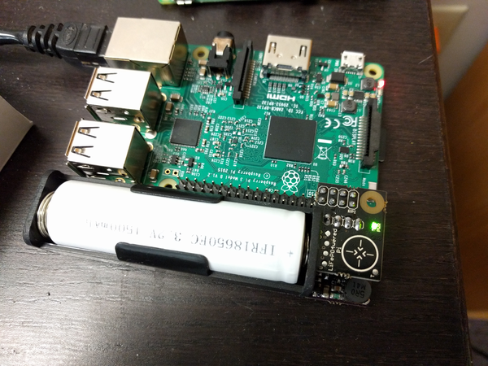

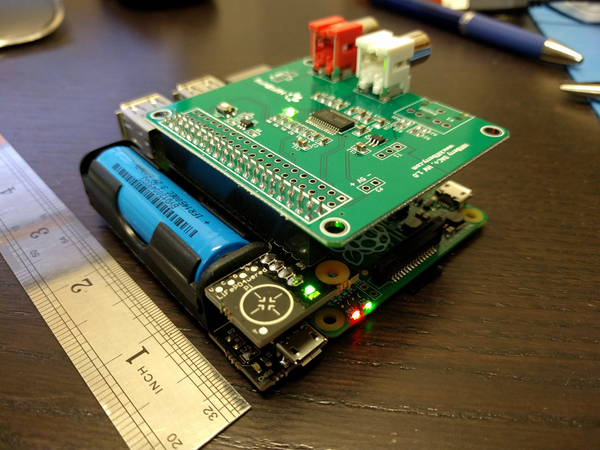

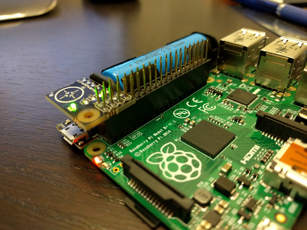

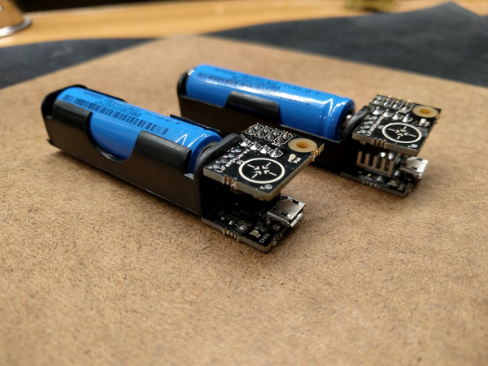

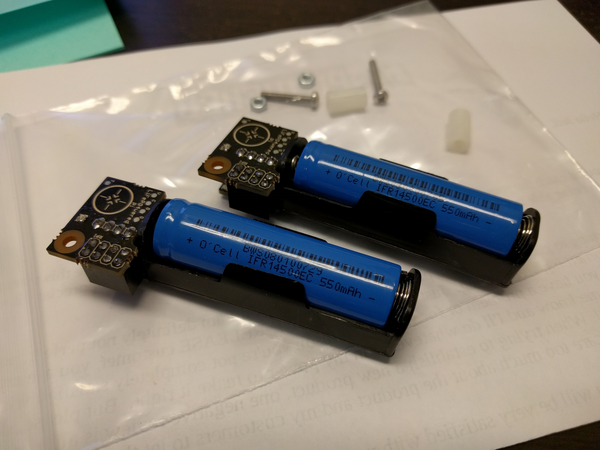

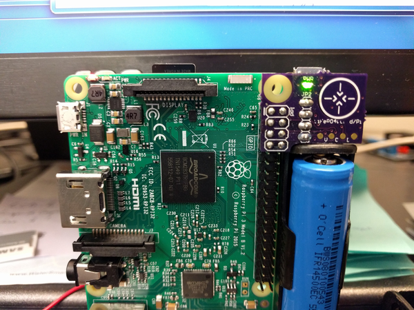

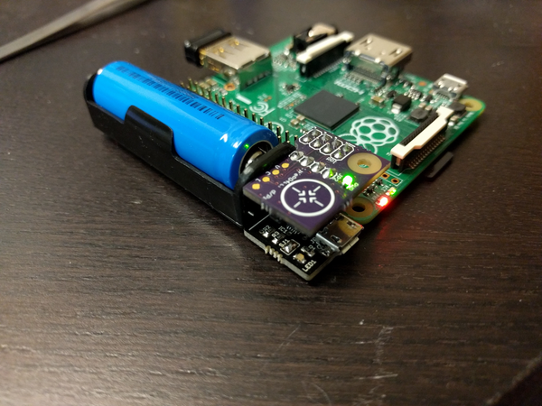

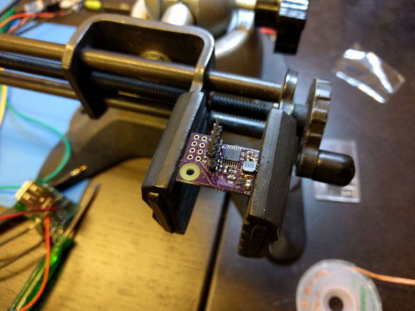

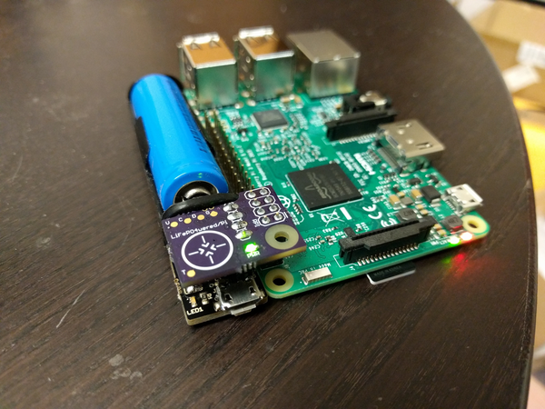

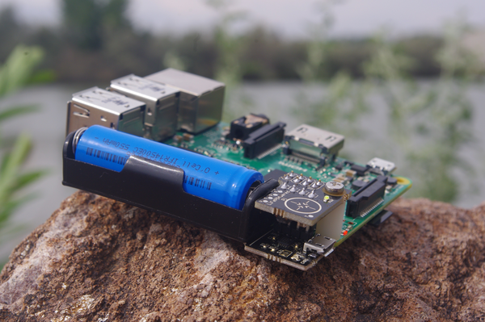

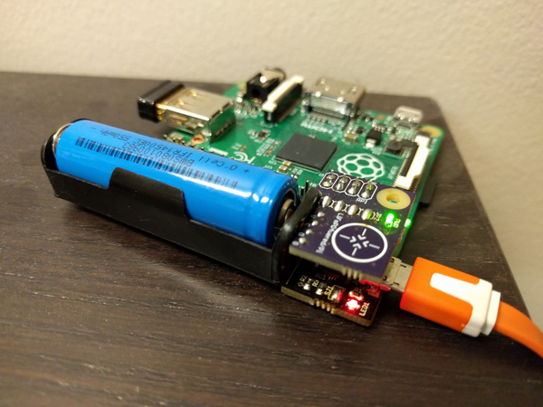

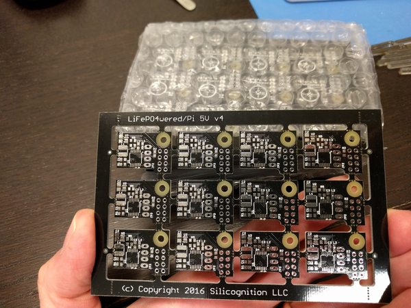

* Here are the Hackaday.IO entry about this backup battery for the Raspberry PI, [https://hackaday.io/project/9461-lifepo4weredpi](https://hackaday.io/project/9461-lifepo4weredpi).

* Here is the screenshot of this project entry in Hackaday.IO.

