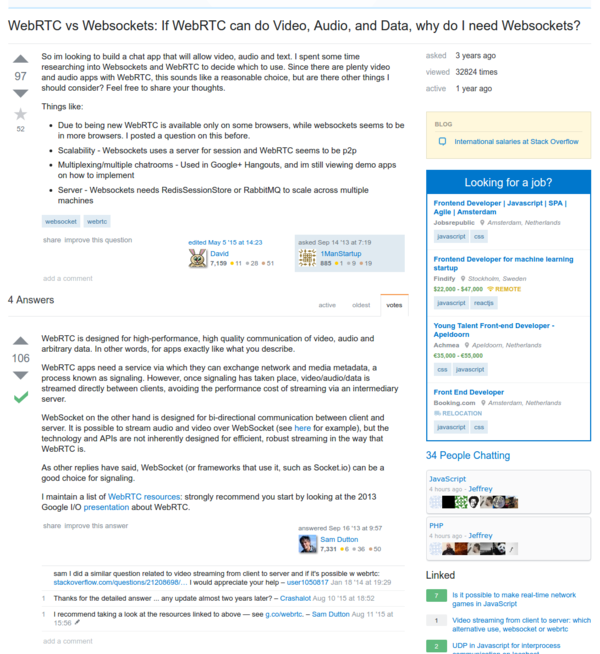
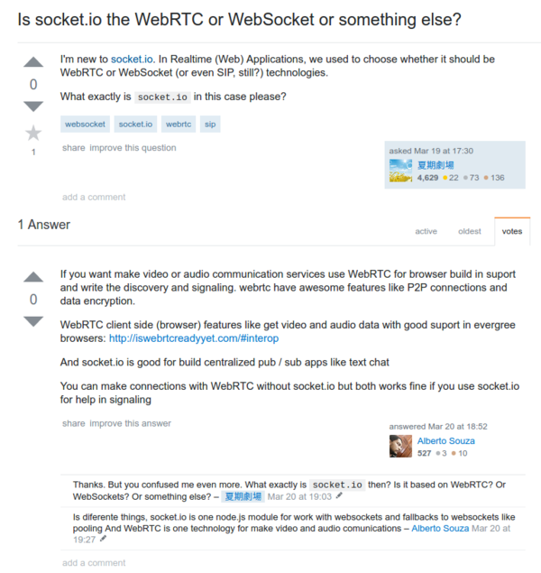

* To sum up, WebRTC is good for streaming and peer to peer web application, while WebSocket is good for centralized real time application like broadcast event or chat.
* WebRTC is more high performance, while WebSocket is more for bi directional communication.
* So, for video chat application. The streaming should be done within WebRTC while the text chat should go with WebSocket.
* Links to StackOverflow discussion are these.
    * [http://stackoverflow.com/questions/18799364/webrtc-vs-websockets-if-webrtc-can-do-video-audio-and-data-why-do-i-need-web](http://stackoverflow.com/questions/18799364/webrtc-vs-websockets-if-webrtc-can-do-video-audio-and-data-why-do-i-need-web).
    * [http://stackoverflow.com/questions/36104843/is-socket-io-the-webrtc-or-websocket-or-something-else](http://stackoverflow.com/questions/36104843/is-socket-io-the-webrtc-or-websocket-or-something-else).
* Screenshot of both discussions.

