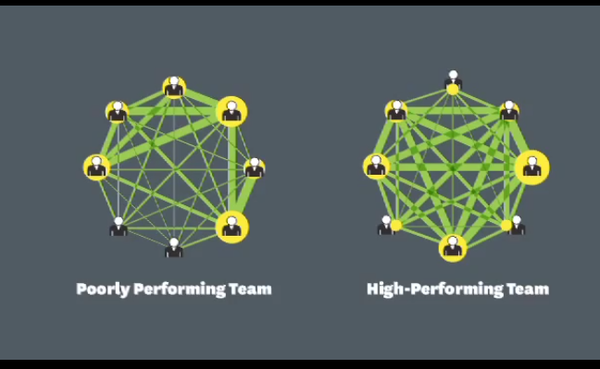

* YouTube video link here, [https://www.youtube.com/watch?v=VoDCo-mEbq0](https://www.youtube.com/watch?v=VoDCo-mEbq0).
* Sociometric Badge is intended to be used to detect pattern of communications in a group. So, not for individual.
* It is known here that Sociometric Badge can know the body languages of the wearer. Perhaps this is done using the angle sensors that is 1 of the 4 sensors in the Sociometric Badge.
* Using the RFID the badge know who you are currently talking to.
* And also the location of when the conversation happen.
* This is achieved with the RFID. There is an article that stated that the maker of this badge is using RFID in a room in collaboration with RFID in the badge itself to know the location of the wearer.
* However, there will not be RFID in a private place like toilet.
* Based from this video the content of the communication is not known.
* And it is not necessary to know the content of the communication.
* The professor name is Professor Sandy Pentland from MIT Media Arts group.
* I would suspect that this man is actually come form Human Dynamics group.
* Aside from pattern of communication this Sociometric Badge also detect the energy that is within the conversation.
* Data gathered from this Sociometric Badge then can be used to determine which group has strong performance and which group has lower performance.

* The performance means the productivity of the team on delivering deliverables (I think).
* As well as measure effectiveness within the team.
* And also creativity (I am not sure on how the Sociometric Badge can measure creativity on a team).
* So in total there are these thing that can be inferred from the data that is gathered from the badge.
    * Creativity.
    * Effectiveness.
    * Productivity.
* So to sum up the device is no where to be used as personal level.
* On the other hand Professor Sandy Pentland is authored a book called "Social Physics", [https://www.amazon.com/Social-Physics-Spread-30-Jan-2014-Hardcover/dp/B012HTLI0C/](https://www.amazon.com/Social-Physics-Spread-30-Jan-2014-Hardcover/dp/B012HTLI0C/).
* Video attachment.

[./20161019-1359-gmt+2-vwp-youtube-measure-your-team-success-1-2.mp4](./20161019-1359-gmt+2-vwp-youtube-measure-your-team-success-1-2.mp4)