* YouTube link is here, [https://www.youtube.com/watch?v=T-Ji1y6XmrA](https://www.youtube.com/watch?v=T-Ji1y6XmrA).
* Alright this video is pretty abstract.
* It talks about human signal.
* What is human signal?
* If not anything I just found this article instead, [http://web.media.mit.edu/~sandy/2010-05Pentland.pdf](http://web.media.mit.edu/~sandy/2010-05Pentland.pdf).
* This article was from 2010. So that is it means a lot of stuffs from the sociometric badge can be rebuild using newer technology?
* There is this term called "reality mining" using some electronics sensor.
* 1 thing that make me not quite sure is that how can thing that small have a processing power to process speech? The device itself was made using technology from < 2010. Perhaps using the same technology like the 2010 cell phones?
* The main initial idea is for the technology to be a wearable technology. A gadget that somewhat embedded into a human body like clothes.
* There is also smart badge as an alternative to sociometric badge, [https://www.zebra.com/us/en/products/mobile-computers/handheld/sb1-smart-badge-series.html](https://www.zebra.com/us/en/products/mobile-computers/handheld/sb1-smart-badge-series.html). Which is somewhat more personally interactive since it has screen.
* They claim that the smart badge is a affordable solution. But the price is around 300 Euros each, [https://www.centralpoint.nl/rfid-mobile-computers/zebra/sb1-smart-badge-art-sb1b-se11a0ww-num-4377437/](https://www.centralpoint.nl/rfid-mobile-computers/zebra/sb1-smart-badge-art-sb1b-se11a0ww-num-4377437/). Better go with Pebble Watch I guess.
* All in all I am not sure which one is better for what kind of thing, either the sociometric badge or the smart badge from Motorolla.
* Video attachment is below.

[./20161019-1359-gmt+2-vwp-youtube-sensing-and-sociometric-badge-1-1.mp4](./20161019-1359-gmt+2-vwp-youtube-sensing-and-sociometric-badge-1-1.mp4)

* Screenshot from, [https://www.zebra.com/us/en/products/mobile-computers/handheld/sb1-smart-badge-series.html](https://www.zebra.com/us/en/products/mobile-computers/handheld/sb1-smart-badge-series.html) about the smart badge.
* Here it has manual and some specification documents.

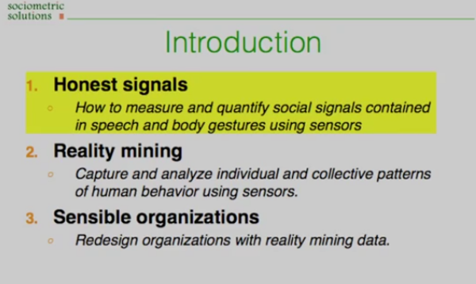

* The first 2 points are already done within MIT.
* So they want to bring this sociometric badge into more applicable case. Of which into how organizational communication works.

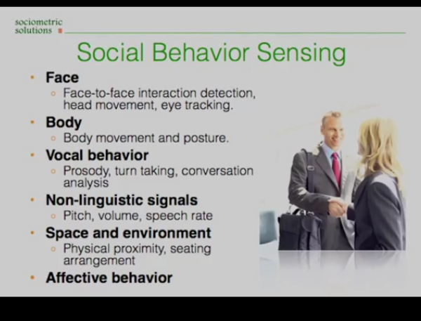

* Good example of variables those are can be captured via sensors within the sociometric badge.

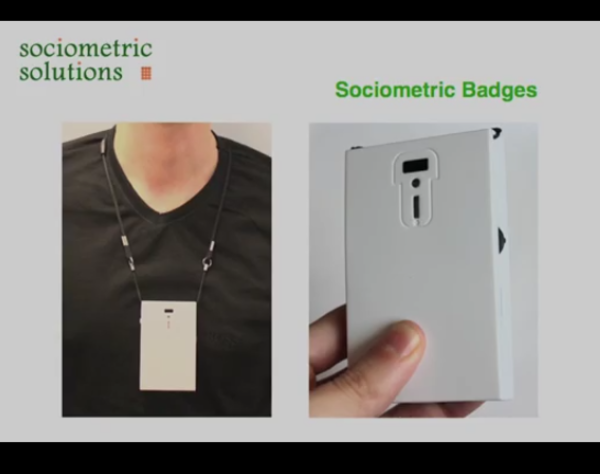

* The small IR (infrared) is used to detect whether the communication is face to face.
* So this means that the user need to know precisely on how to use this sociometric badge.
* There should be a strict guidelines on how to use this badge.

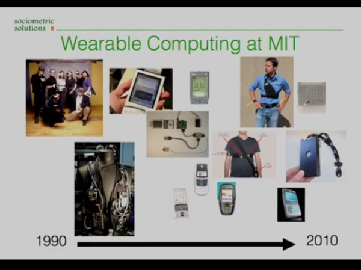

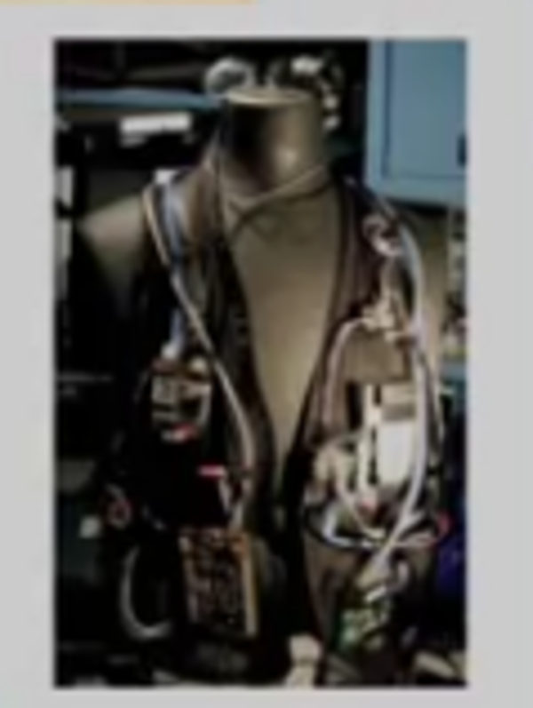

* Example of wearables technology those were developed by MIT in the past.

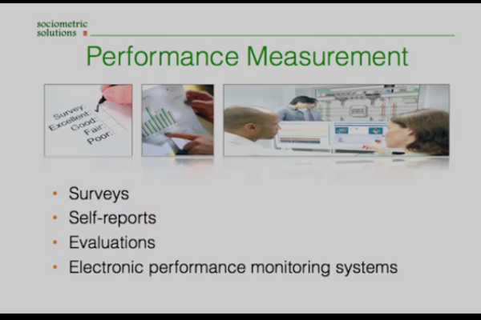

* Example of traditional performance scoring system.

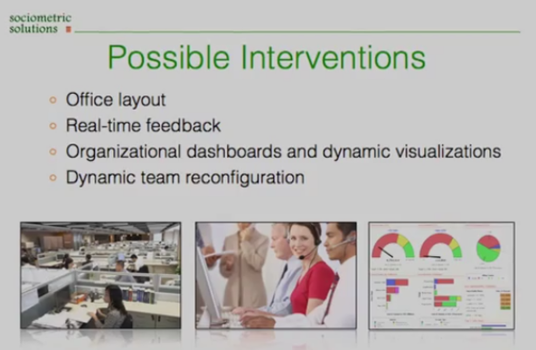

* Possible applications using data received form the sociometric badge.

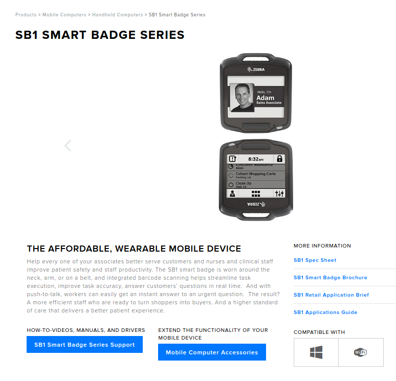

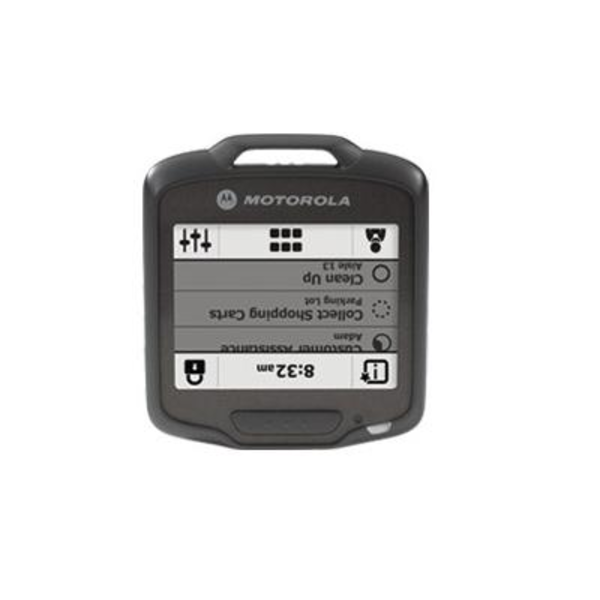

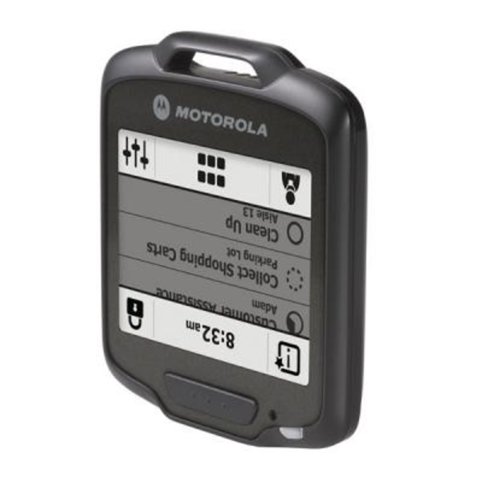

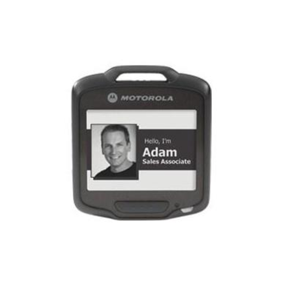

* Example of the smart badge.