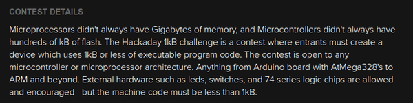
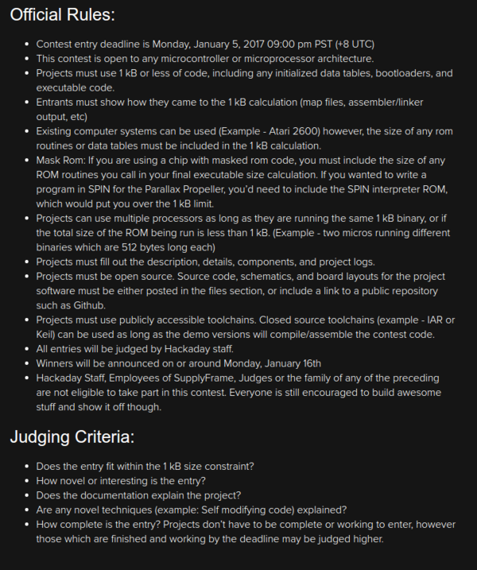

* There is a 1 kilo Byte challenge in Hackaday ([http://hackaday.com/](http://hackaday.com/)).
* This challenge is basically to create a program with 1 kB limit.
* The 1 kB should be without anything attached.
* Means there cannot be `Arduino.h` attached to the program. Or any libraries that exceed 1 kB in size.
* Here is the contest page, [https://hackaday.io/contest/18215-the-1kb-challenge](https://hackaday.io/contest/18215-the-1kb-challenge).
* Here is the first blog post, [http://hackaday.com/2016/11/21/step-up-to-the-1-kb-challenge/](http://hackaday.com/2016/11/21/step-up-to-the-1-kb-challenge/).
* Summarization from the contest page.

* At the time I write this there are 10 submission already.
* However, there is not a single thing that caught my attention yet.

* The introductory paragraph about this 1 kB challenge.
* This paragraph says that I can even use Arduino or ARM based micro controller.
* However, after reading this, I am still not sure if the `Arduino.h` or Raspberry default Python libraries count toward the 1 kB calculation.
* I think that Arduino standard library should count toward 1 kB space. Because, if not I can make a modification in the `Arduino.h` and make anything works.

* The official rules and the judging criteria.

* There is this rule that says that any participant should show on how the program is actually 1 kB.
* I think for this I need to know the exact space(s) for every variables that I uses within the codes.
* And then display it like in system defragmentation application.

* It is allowed to use multiple micro controller as long the total codes is still less or equal to 1 kB.

* Project must be open source.

* There should be accessible tool chain. For example, it will not be allowed to use Arduino codes if (hypothetically) Arduino compiler is not free.

* This is the judging criteria.
* The one that is concerning is the "novel technique" part. Because I think my program will be a simple one.

* There is also blog as well with regard to this competition. But for now there is nothing related to this competition except from the introductory blog.
* Below is the full screenshot of the challenge specifications.

*The introductory blog post for this 1 kB challenge.

* Learn to be an old school micro controller programmer!

* Debugging was done using a circuit emulator instead of now I can just use Arduino serial communication to debug my Arduino codes.

* The main constraint of this challenge is to make something good with only 1 kB of codes.

* Using other media to store the codes (for example an SD card) is prohibited.