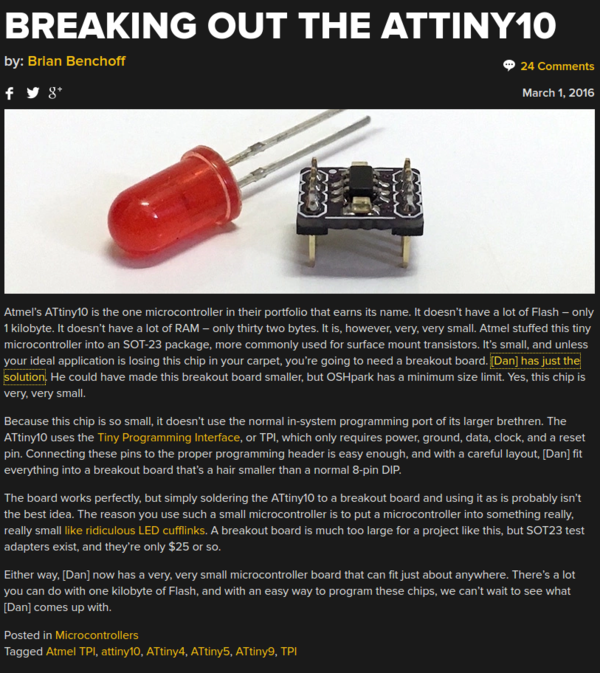
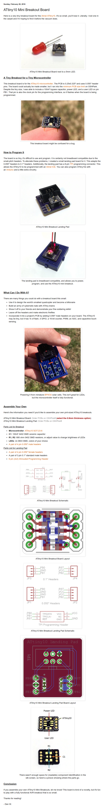

* ATiny10 breakout board.
* Link to blog article from Hackaday, [http://hackaday.com/2016/03/01/breaking-out-the-attiny10/](http://hackaday.com/2016/03/01/breaking-out-the-attiny10/).
* Creator personal blog post, [http://syncchannel.blogspot.nl/2016/02/attiny10-mini-breakout-board.html](http://syncchannel.blogspot.nl/2016/02/attiny10-mini-breakout-board.html)
* Screenshot from Hackaday.

* Screenshot from creator personal blog post.

* Here are 2 PCB files for the ATiny 10 breakout and the breakout for breadboard programmer.
    * [https://oshpark.com/shared_projects/HjnJTo5S](https://oshpark.com/shared_projects/HjnJTo5S).
    * [https://oshpark.com/shared_projects/tbB2lM2K](https://oshpark.com/shared_projects/tbB2lM2K).

[./20161130-0004-gmt+2-attiny10-breakout-design-3-breakout.brd](./20161130-0004-gmt+2-attiny10-breakout-design-3-breakout.brd)

[20161130-0004-gmt+2-attiny10-breakout-design-4-breakout-programmer.brd](20161130-0004-gmt+2-attiny10-breakout-design-4-breakout-programmer.brd)