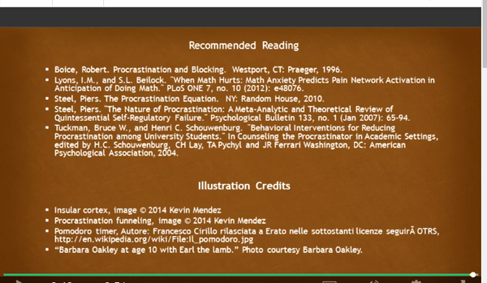
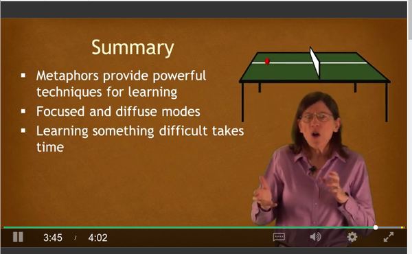
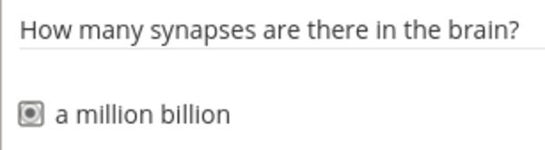

* Recommended book to read "A Mind For Numbers", [https://www.amazon.com/gp/product/039916524X/](https://www.amazon.com/gp/product/039916524X/).
* Understand the basic of how brain works.
* 2 different focus thinking.
    * Diffuse, relaxed thinking style, neural resting style.
    * Focus, the traditional, concentrate.
* Metaphor and analogy are really helpful when learning something new.
* Focus mode has a fixed thinking pattern. This is not good if you want to get new idea/perspective. Determined thought pattern.
* Diffuse mode of thinking you look at the big picture perspective.
* You can in the both thinking mode (diffuse and focus mode) at the same time.
* This lecture is meant to reduce frustration and increase understanding.
* Salvador Dali used diffuse thinking. He works with relaxed mind.
* Thomas Edison let his mind runs free. Make the idea in diffuse mode and then arrange every idea in focus mode.
* Building neural habit everyday.
* Metaphor helps to provide powerful media for learning something that is difficult.
* Learning difficult takes time (this is obvious).
* Human brain weights 3 pounds but consume 10 times more energy than weight for the rest of the body.
* Heavy lifting (act and thinking) happen below human level of consciousness.
* The lecturer recommends this website to be visited, [http://brainfacts.org](http://brainfacts.org).
* Procrastination issue. If we are doing something, we are procrastinating on everything else.
* There is an area in the brain that is called Insular Cortex. This is a specific part in the brain that associates/holds feeling of discomfort/pain.
* When there is a negative stimulation, brain tries to distract/switch attention to different things. These different things are something those are more simple and more pleasant to do and fast enough to get achievement with (for example video games or YouTube videos).
* However, scientist believe that as soon we start doing thing that we meant to do the feeling of discomfort/pain is gone.
* So to stop procrastinating we just need to start something right away. The hardest part is to start, after that everything will go on with ease.
* There is a Pomodoro technique. This is like mental gym then mental relaxation. This is simple to do.
    * Start doing thing with no distraction for 25 minutes.
    * So this will be 25 minutes of full concentration.
    * After 25 minutes do some relaxation for 5 minutes.
    * For every 2 hours do 15 minutes of relaxation.
    * For me and most people coffee or tea helps!

* Example analogy of focused mode.
* The the diffused mode counterpart has way less obstacles.
* This pinball analogy means that the mind wander around on exact route (focused mode).
* The other pinball analogy is for diffused mode of which has way less obstacles. This means that the mind wander more freely than when there are a lot of obstacles (focused mode).

* Some credits.

* Another credits and other relevant readings as well.

* The technique to get out of procrastination is called Pomodoro technique.
* Set 25 minutes to be on full attention mode. There is no distraction at all (not even a bit). Then after the 25 minutes passed goes to have break for 5 minutes.
* Both 25 minutes and 5 minutes are equally important because those 25 minutes will make our brain tired and makes the 5 minutes break become a necessity to cool our brain down.

* Another credits and recommended readings.

* Here is the pinball analogy of diffused and focused mode.
* Note that the difference is that the focused mode is more deterministic than the diffused mode.

* This course objectives.
    * Diffused mode and focused mode of thinking.
    * Chunking!
    * Working memory and long term memory.
    * These methods.
        * Deliberate practice.
        * Interleaving.
        * Metaphor.
        * Pomodoro.
        * Story.
        * Visualization.
    * Able to determine what is/are the problem(s).
        * Choking.
        * Einstellung.
        * Illusions of learning.
        * Lack of sleep.
        * Multi tasking.
        * Over learning.
        * Procrastination.
    * Important aspects of test preparation.
    * Explain the important of mindset in learning. I think this is like what is your goal on learning something.

* Here are resources and reading references.
* I will not read through all of these I think.

* Metaphor provides powerful techniques for learning.
* I think metaphor is the same as analogy.
* Learn how to balance both diffused and focused mode of study.
* Need to mention that learning takes time. So do not expect to learn something over night.

* Brain image. The red area is when we are sleeping while the blue area is when we normally thinking.
* I actually forget what is this image exactly XD.
* I think the lecturer wants to explain which part is for conscious thinking and which part is for unconscious thinking.

* Carbon tube is the same diameter as synapse.
* Synapse is like memory block in computer programming.

* When learn something new many synapse are formed on the dendrites.
* Dendrites are an extension of nerve cell. I think this is like a wire that connect/wiring other synapses together.

* There are a million billion synapse in the brain.