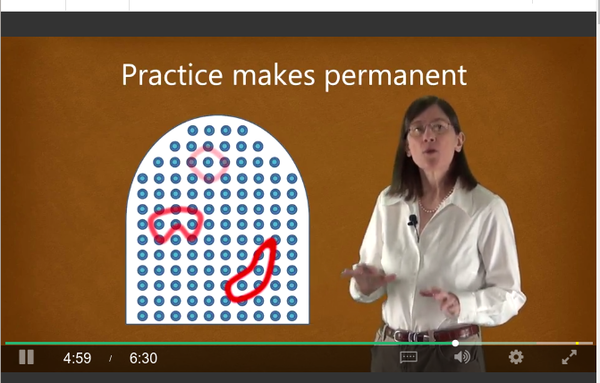
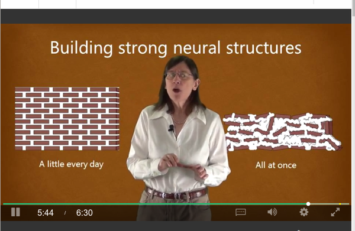
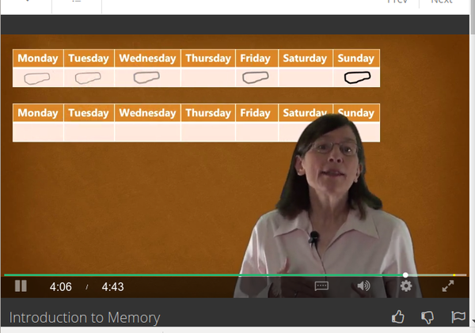
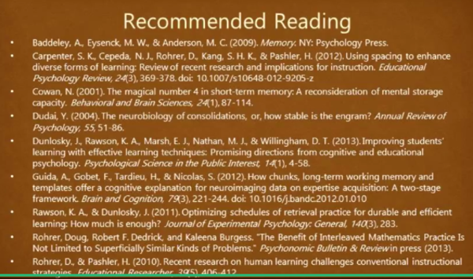
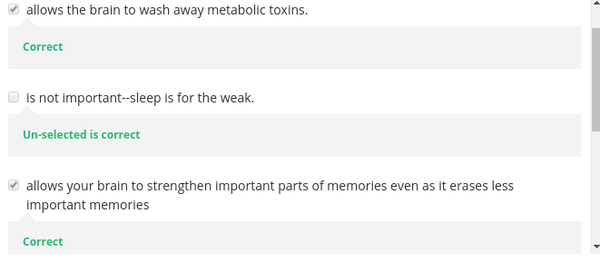
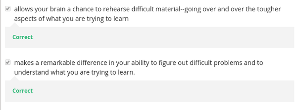
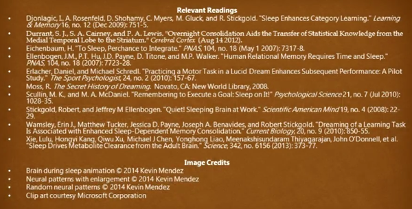
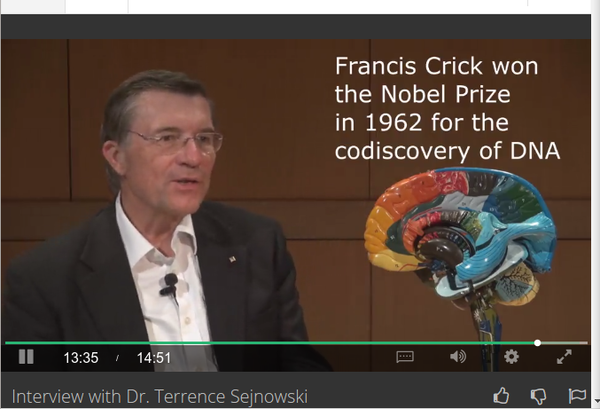

* Practice makes permanent. Do something that is smaller and not so ambitious before taking into more ambitious goal.
* Dr. Barbara Oakley, professor of engineering started learning mathematics and science at age 26. Before she hated mathematics and would not think to start career in mathematics.
* Engineering and science is an abstract idea. Hence, it is harder to learn. Human is easier to learn when there are a concrete example present.
* There is this neural pattern. I think this is like myelin (muscle memory) but for thinking. This neural pattern must be built periodically.
* Do not learn by cramming everything into short period of times. Hence, over a night study before examination is never preferable.
* There are long term memory and working memory.
    * Working memory is like computer RAM (random access memory). Working memory is processing what is currently happen.
        * The lecturer said that working memory is like inefficient mental black board.
        * Scientists used to says that working memory is capable of holding 6 chunks of information.
        * However, they later revised this into only 4 chunks of information that can be hold at a given time.
    * Long term memory is like computer HDD/SSD which meant to store something permanently.
* So the mission here is to transfer working memory into long term memory.
* There is a technique called space repetition. Which means to repeat what we have learn in interval of days. Perhaps like at the 1st day I started to learn and then I repeat again what I have learn in 1st day for every 2 or 3 days. This is just like waiting cement to dry before adding additional bricks.
* So here repeating is the key.
* It is also said somewhere that without repeating working memory would go nowhere.
* Sleeping gets rid of poison in the brain.
* If you take a test without sleeping, that means that in the test you are thinking with metabolic toxins in your brain. Which makes you cannot think properly.
* Having less sleep time also not good. Because this destroys your natural timer of sleeping and working.
* Sleeping is like defragmenting partition in computer. It removes unnecessary memory block and make sure everything runs seamlessly again.
* Also proper sleeping make sure you have chance to having dream about the material you want to learn. This will increase power of memory of material you have studied. Because you have something to correlate with.
* Is lucid dreaming the key to have every material to be dreamed in?
* I know, there is a technique to have 100% rate of lucid dreaming every time someone is sleeping.
* Interview with Doctor Sejnowski.
    * What you do to learn something new?
        * I like to get practical and learn by doing.
    * How to pay attention to boring lecture?
        * Make it interactive by asking question. However, he said there is no simple thing to achieve this. Hence, I think the solution will vary from person to person.
    * How to get into diffuse mode of thinking?
        * Exercise and waling is a simple way to get into diffuse mode of thinking.
        * The problem is then how to remember those ideas you get from the diffuse thinking session.
        * Doctor Sejnowski said that it is good to bring a notebook to capture those ideas.
    * Do you do multi tasking?
        * Multi tasking is necessary.
        * There are a lot of things those he needs to take attention of, for example emails, ....
        * The solution here is to juggle within task.
        * For him he has a specific time in the afternoon to have reflective session of which he everything mostly done.
    * Do you do multiple things at once?
        * This is possible but hard!
        * Some people are better than other at doing multiple things at once.
        * Switching between tasks are hard because you cannot switch things in the middle of focus.
        * Fortunately for him, he has colleagues and students that helped him with doing multiple things at once (delegation).
    * Do you apply your study of neuroscience in your own life?
        * Learning to change connection between neuron.
        * Shrinkage of the cortex, hippocampus.
            * Most mammals has 2 hippocompi.
            * Hippocompus is used to store short and long term memory (working and long term memory).
        * New neurons can even born in the adulthood. The key is to exercise and live healthy I think.
        * Do social activity. Social activity makes neuron connection to be 100% stronger (twice stronger).
        * Exercise improve the number of neuron born and survive.
        * Also need to live healthy!
        * Switch from brain memory and muscle memory. When you are tired on the other make sure to switch into other form of memory. To use muscle instead of using brain.
    * Do you have special technique?
        * Being in creative environment.
        * Having other people to bounce idea around.
    * How do you keep creative?
        * Stay in good environment.
        * Colleagues and student.
        * Basically having youth around.
    * Any advice for high school or college student?
        * To be passionate and persistent!
        * He have seen people who is smart but is not success because they have no passion and not persistent.
        * Passion and persistent is the best quality that people emust have.
* Francis Crick brain. Nobel prize for discovery of DNA.
* Doctor Sejnowski said that to learn you need to always see from different perspective.

* Practice makes perfect, enough said.

* Building strong neural structures.
* In order make a good foundation, cramming/learning everything in one day is not good.
* Learn everyday and makes it to be a good foundation.

* Space repetition technique.
* Means that every 2 or 3 days you repeat what you have learn. This makes very strong neural foundation.

* Another tons of recommended reading list.

* Benefits of sleeping.
    * Neutralize metabolic toxins.
    * Defragment your brain. Remove unnecessary memory blocks and strengthen memory that is important for us.

* Benefits of sleeping.
    * Allow brain to rehearse difficult material.
    * Make a huge difference in ability to figure problems and to understand what I am going to learn.

* Another credits and recommended readings.

* Francis Crick brain model.
* Francis Crick is a nobel prize winner for his discovery of DNA.
* His Wikipedia page, [https://en.wikipedia.org/wiki/Francis_Crick](https://en.wikipedia.org/wiki/Francis_Crick).