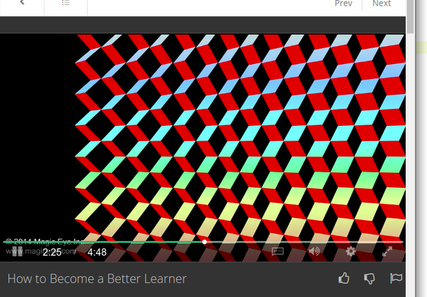
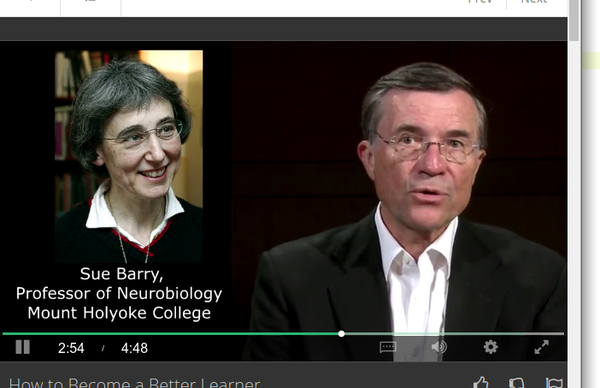
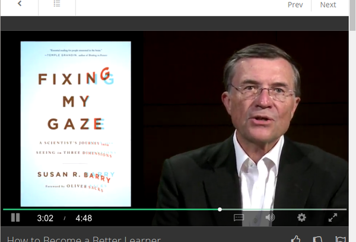

* This video is basically Terry Sejnowski talking on his tips on learning better.
* Then later in the video he gives some scientific information about prefrontal cortex.
* Here are his tips on how to be a better learner.
    * Physical exercise is important.
        * Physical exercise helps your hippocampus to produces more neurons.
        * More neurons means more "free space" to learn new things.
    * Practice makes perfect, but only when your brain is prepared and ready.
* Sudden improvement can occur in any time during our life on any subject. Hence, we need to always prepare brain to receiving something new.
* Human develops binocular depth perception within the first 2 years of life.
* Binocular depth perception helps human on defining stereoscopic image.
* There is this website that shows a lot of stereoscopic images, [http://magiceye.com/](http://magiceye.com/).
* Here is an example of stereoscopic image.

* Here are my own method on how to see stereoscopic image.
    * Put your eyes rather close to the stereoscopic image.
    * Put your eyes attention in the middle of the image.
    * Cross your eyes.
    * Put your eyes even closer into the stereoscopic image.
    * Hold your vision for 3 to 5 seconds.
    * Release your vision!
* There is people who cannot see stereoscopic image at all. They are called stereo blind.
* This is happen because during the first 2 years of living their eyes is not trained to see stereoscopic image.
* This could not be fixed until (permanent stereo blind), until Professor Sue Barry defined an exercise on how to train eyes to see stereoscopic image.
* Prefrontal cortex is located in the most front of human brain.
* Prefrontal cortex helps in complex analysis of social behavior.
* Prefrontal cortex helps on making decision and planning.
* Until the prefrontal cortex is mature enough, there would still be "zombies" in you.
* What he meant by "zombies" here is that thing that happened automatically without thinking. It is like an untrained reflex.

* Another example of stereoscopic image.

* The photo of Sue Barry. I am not sure if this is any important.

* Sue Barry's book title "Fixing My Gaze" tells people on how to train eye vision. This including on how to see stereoscopic image.