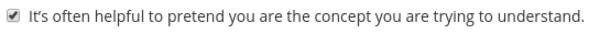
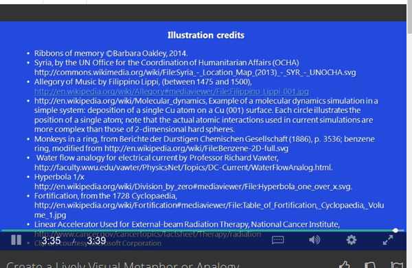

* Renaissance learning.
    * How to perform well on test.
    * Learning with extensive use of analogy and metaphor.
    * Work profitably with teammates.
* Learning does not progress logically.
    * Frustration happens.
    * Sometimes you learn faster sometimes you learn slower.
    * There could be a wall in every aspect you want to learn.
        * In the video, the lecturer gave an example about how to understand Russian cyrillic words.
* This course tells me on how important it is to have image connection between each things that I learn.
* Always, refer a knowledge to an image.
* The more visual the connection is, the better the connection would be.
* The lecturer gave an example about remembering Syria (a country) as a cereal bowl.
    * Because Syria can be looked as a tilted cereal bowl in the world map.
    * And Syria is phonetically similar to cereal.

* Example of image credit by the end of presentation.

* Example of analogy and metaphor of Syria.

* Here is a good analogy on how to understand how electricity works.
    * Electrons are analogues to water.
    * Batteries are analogues to pump.
    * There is upper ramp that tells that electrons/water there has/have more potential over those in lower ramp.
    * There is a turbines that analogues as a resistor.\
* I never has a clear instruction on how electronics works until I saw this image.

* Make your self in the situation of the subject you want to learn.

* Example on how to remember chemical structure.
* The monkeys those are connected by hand means a 2 lined connections between atom.
* The monkeys those are connected by tails means a 1 lined connection between atom.

* Cation is the positively charged ion.
* Remember a cat's paws, "pawsitive".

* Anion is negatively charged ion.
* Remember that onion makes you cry.

* It is often helpful to imagine yourself as the concept you are trying to understand.

* Another example of image credit in this presentation.