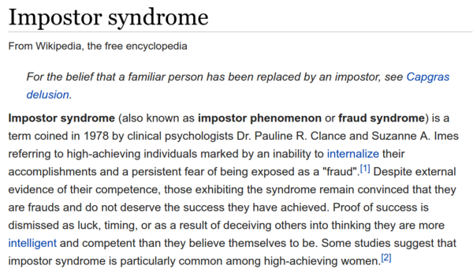

* There is no need to envy those who are naturally gifted.
* Keep track on everything!
* Whether you are naturally competent or stupidly bad at a thing, you can always chunked down everything into the dumbest smallest ideas to start grasping from there.
* Interleaving also works. To keep yourself expect on what thing you are about to learn.
    * By just seeing the content without thinking anything.
    * By skimming.
    * Rapid reading.
* Science and sport have different method of learning.
    * Science is more about learning instead of training.
    * Science is more into understanding on how theories are working.
    * Sport obviously use more memory brain than when you are learning science.
    * Analogy and metaphor works better in learning science I think.
* Nevertheless, conventional explanation works in setting the base knowledge.
* Experts are trained to make complex decision rapidly. These are some examples.
    * Doctor.
    * Pilot.
* Self consciousness is not good to be used when making complex decision rapidly.
* The ideas and theories that you already have in mind can be a blockade to new ideas/knowledges.
* So, there is a benefit of being stupid because easier to process new ideas. Whereas smarter people tends to stuck with the ideas that they have learn.
    * New thought can be easily go through your brain.
* Smaller working memory make easier for you to generalize what you have learning in new way.
* Smaller working memory does not locked you on learning new things.
* For example, the discovery of electric lamp did not come from constant iteration of candle.
* Nevertheless, create chunks. A lot of it. Because chunk could be used in many other unrelated subject.
* Deliberately practices in the hardest part.
* There is this imposter syndrome. Impostor syndrome (also known as impostor phenomenon or fraud syndrome) is a term coined in 1978 by clinical psychologists Dr. Pauline R. Clance and Suzanne A. Imes referring to high-achieving individuals marked by an inability to internalize their accomplishments and a persistent fear of being exposed as a "fraud".
* Wikipedia pages, [https://en.wikipedia.org/wiki/Impostor_syndrome](https://en.wikipedia.org/wiki/Impostor_syndrome).
* Screenshot of the Wikipedia page.

