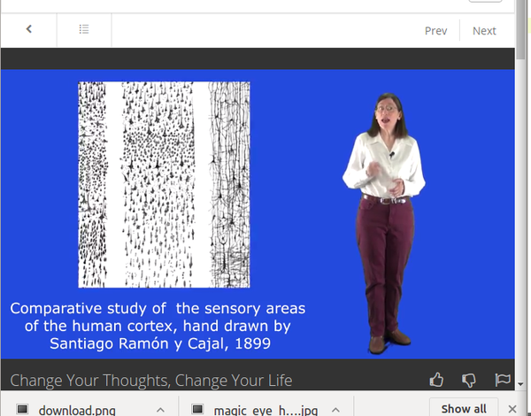
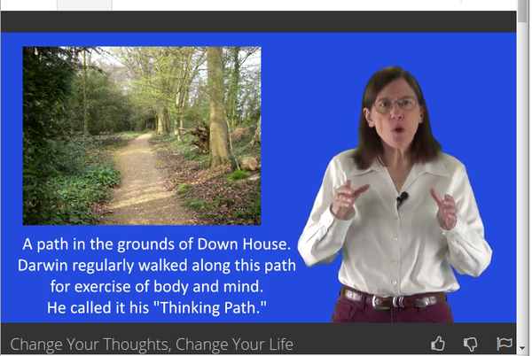
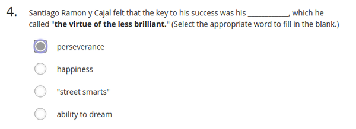
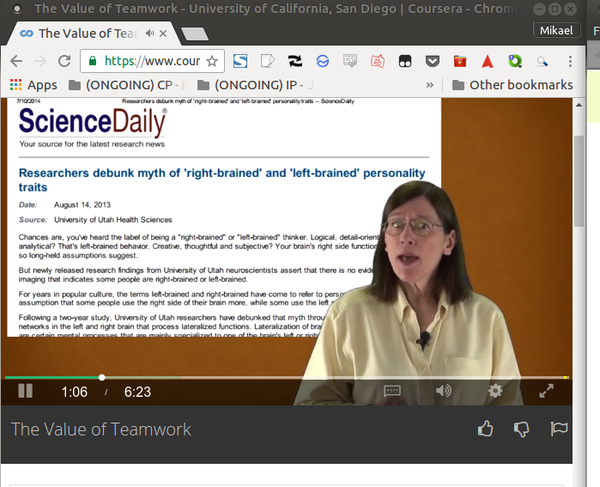
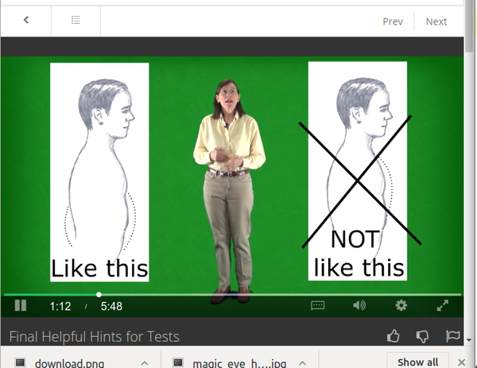

* Create yourself your own brain manual. Because every person have different habit and talent. Hence, the most efficient way to learn something will also be different.

* Photo of a sensory area.

* Darwin was exercising his body and mind.
* He was using a technique called "Thinking Path", [http://www.nlpu.com/Articles/article6.htm](http://www.nlpu.com/Articles/article6.htm).

* The key of success is perseverance.

* The lecture mentioned something about left and right brain.
* Right side of brain is more for creativity.
* Left side is more for logic. The left side of brain can sometimes trick you to think that you have a correct answer.

* How to breathe to manage nervousness and stress.