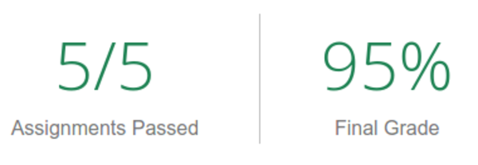
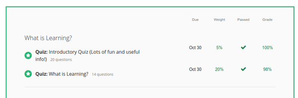
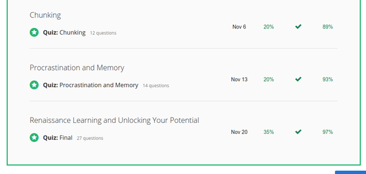
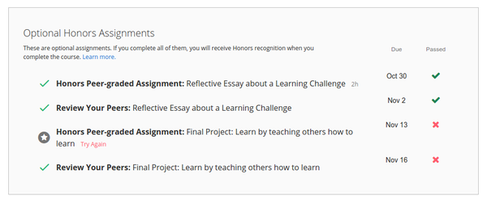

* I finished this course.
* However, I do fail on the final assignment for the honor program.
* Although I managed to finish this course with 95% grade, I still think that it would be good for me if I can get the honor recognition as well.
* Nevertheless, I finished the course with 95% grade. I am happy with fact that this is the first time I completed a MOOC course.
* Here are things that I learned from this course (mostly personal stuffs).
    * Do interleaving as well. This means that I should go around and see another chapter (if studying from book). This is what I called by book sightseeing.
    * Learn to do everything from the hardest part.
    * Please do everything as soon as I know the deadline and the goal(s).
    * Pomodoro method is working for me. So, I will keep using this in the future.
    * Skim everything before studying, this will give me a good perspective on what I will learn.
* Here is the screenshot of my report.

* There are some videos those I have not yet watch. Especially the interview video. I will do this in the upcoming days.