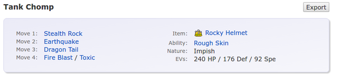

* Tank Garchomp build Pokemon generation 6 from Smogon, [http://www.smogon.com/dex/xy/pokemon/garchomp/](http://www.smogon.com/dex/xy/pokemon/garchomp/).
* Moves.
    * Dragon Tail.
    * Earthquake.
    * Fire Blast or Toxic.
    * Stealth Rock.
* There are two suggested EVs spread.
    * Physical tank Garchomp.
        * Defense 176.
        * HP 240.
        * Speed 92.
    * Hybrid tank Garchomp.
        * Defense 164.
        * HP 252.
        * Special Defense 76.
        * Speed 16.
* These are the screenshot from Smogon.

* For me I will build both EV spread with Fire Blast instead of Toxic. Because if using Toxic, it makes the Garchomp failed to hit steel type Pokemon with levitate (Bronzong, magnet rose Pokemon).
* Garchomp 1.
    * EVs.
        * Defense 176.
        * HP 240.
        * Speed 92.
    * Moves.
        * Dragon Tail.
        * Earthquake.
        * Fire Blast or Toxic.
        * Stealth Rock.
* Garchomp 2.
    * EVs.
        * Defense 164.
        * HP 252.
        * Special Defense 76.
        * Speed 16.
    * Moves.
        * Dragon Tail.
        * Earthquake.
        * Fire Blast or Toxic.
        * Stealth Rock.