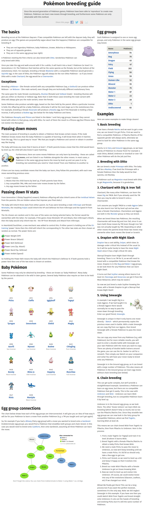

* There is this in depth breeding tutorial from PokemonDB, [http://pokemondb.net/mechanics/breeding](http://pokemondb.net/mechanics/breeding).
* It also cover which different egg groups can breed.
* Below is the screenshot of the guide.

