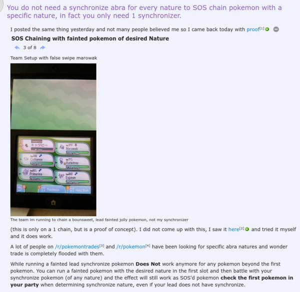

* Synchronize Pokemon guide from Reddit for Pokemon Sun and Pokemon Moon, [https://www.reddit.com/r/pokemon/comments/5g6kr3/you_do_not_need_a_synchronize_abra_for_every/](https://www.reddit.com/r/pokemon/comments/5g6kr3/you_do_not_need_a_synchronize_abra_for_every/).
* So, there is no need anymore to get specific Abras for synchronize the nature.
* I can just lead with a dead Pokemon with desired nature in the first slot and then give second position to the Pokemon with Synchronize ability. Hence, the battle will start with second slot Pokemon that has Synchronize ability.

