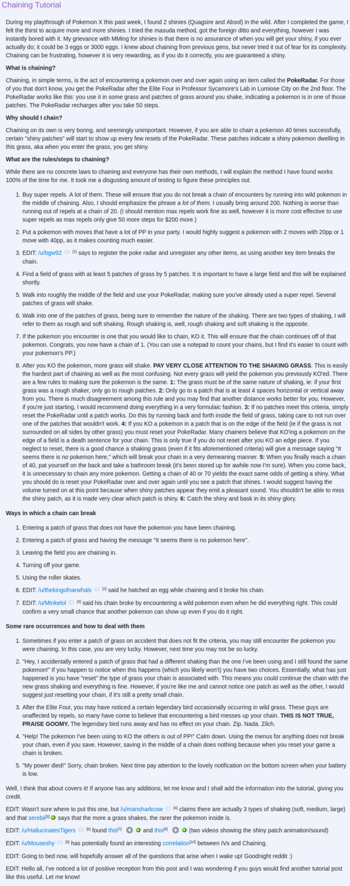

* Here is tutorial on how to do PokeRadar chaining in Pokemon X or Pokemon Y.
* The higher the chain the higher the chance of getting shiny Pokemon.
* And after 60th chain the Pokemon will guarantee 3 perfect IVs (31 IVs).
* Here is the link to the tutorial, [https://www.reddit.com/r/pokemon/comments/1ot6ex/chaining_tutorial/](https://www.reddit.com/r/pokemon/comments/1ot6ex/chaining_tutorial/).

