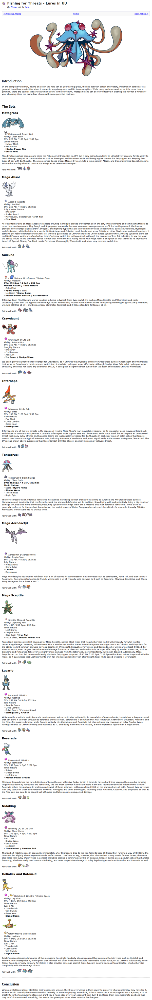

* There is this lure Pokemon builds from Smogon, [http://www.smogon.com/articles/lures-in-uu](http://www.smogon.com/articles/lures-in-uu).
* Lure Pokemon means a Pokemon that has a specific moves to counter Pokemon that counter it.
* For example Nidoking with Thunder Bolt. When people sent out Nidoking the enemy will go for water type Pokemon. When the bait is eaten Nidoking can just go for Thunder Bolt to 0HKO the water Pokemon switch in.
* Here are all the example build in UU.

