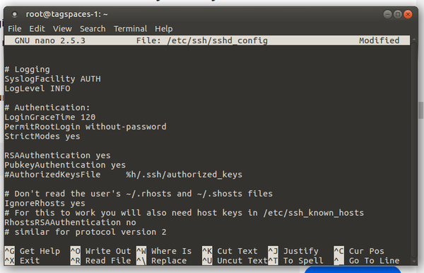

* Right now I want to install TagSpaces in WebDAV server using DigitalOcean droplet, [https://cloud.digitalocean.com/](https://cloud.digitalocean.com/).
* I found this tutorial in DigitalOcean on how to have OwnCloud server installed on Ubuntu 16.04 (currently the latest LTS Ubuntu), [https://www.digitalocean.com/community/tutorials/how-to-install-and-configure-owncloud-on-ubuntu-16-04](https://www.digitalocean.com/community/tutorials/how-to-install-and-configure-owncloud-on-ubuntu-16-04).
*  Based from the tutorial I need to have initial server setup with Ubuntu 16.04. So here there is this tutorial also provided from the DigitalOcean itself, [https://www.digitalocean.com/community/tutorials/initial-server-setup-with-ubuntu-16-04](https://www.digitalocean.com/community/tutorials/initial-server-setup-with-ubuntu-16-04).
* I wanted to erase unnecessary SSH keys in my DigitalOcean account. So I look here to look for guidance, [https://www.digitalocean.com/community/questions/how-to-remove-ssh-in-digitalocean-portal](https://www.digitalocean.com/community/questions/how-to-remove-ssh-in-digitalocean-portal).
* Here is a tutorial on how to generate SSH key for Linux and MacOS based computer, [https://www.digitalocean.com/community/tutorials/how-to-use-ssh-keys-with-digitalocean-droplets](https://www.digitalocean.com/community/tutorials/how-to-use-ssh-keys-with-digitalocean-droplets).
* There was a problem when I need to restart the server (I think). This is when I need to restart `root` but there are several root in the display. While in the tutorial there is supposed to be only 1 root. So instead I killed all the connected PID named `root`. I use these codes below, but of course every cases is different.

```markdown
kill -HUP 1466 && kill -HUP 1497 && kill -HUP 1603 && kill -HUP 1606
```

* Alright here I made a mistake, I forget to create SSH authentication for the notalentgeek user.
* So, here I learn that SSH need to be connected for every account in the server and not just for root account.
* I will try to delete the Droplet and start fresh again so that I can understand how this is working.
* Alright now I am back at the part that I was left. Now, I need to generate SSH keys for the new user.
* But first I need to login into the newly created user first.
* I make a mistake again here, instead of using the key that is already in my local I generate new SSH keys in the server from the newly created user.
* Everything went fine but for some reason I cannot make the first admin account for my OwnCloud. Here is the error, `SQLSTATE[HY000][1045] Access denied for user 'user_test'@'localhost' (using password: yes)`.
* I suspect this is because I logged in using wrong password. But I tried to logged in using MySQL interactive shell via SSH it works. I am not sure at which part I make a mistake.
* At this moment I overcome the database error by just making it using SQLite.
* Now I am trying to put TagSpaces in my server but it always return 404 error. I suspect this happen due to improper `chmod` and `chown`.
* Alright I will try to wrap up for to day. I will not care anymore about MySQL database. I think SQLite would just do the work.
* I have posted some questions here.
* [https://www.tagspaces.org/blog/webdav-edition/](https://www.tagspaces.org/blog/webdav-edition/), here I asking what the author meant by `your_www_group:your_www_user`.
    * [https://central.owncloud.org/t/error-when-connecting-to-database-when-creating-first-admin-account/3576](https://central.owncloud.org/t/error-when-connecting-to-database-when-creating-first-admin-account/3576), I tried to ask why I cannot create an admin account in my own OwnCloud. I do not think the responder understand, but nevertheless I am now using SQLite instead of using MySQL.
    * [https://www.digitalocean.com/community/tutorials/how-to-install-and-configure-owncloud-on-ubuntu-16-04](https://www.digitalocean.com/community/tutorials/how-to-install-and-configure-owncloud-on-ubuntu-16-04), here I asked the problem of I cannot login into my "owncloud" database (a database names owncloudin MySQL server). This is not relevant anymore since I am using SQLite for this moment.
* I suspect the solution I could not login into my MySQL database is because I have not yet to start the MySQL server. This is the command to start off MySQL server under Linux based operating system, `sudo /etc/init.d/mysql start`. I can replace the `start` with `restart` or `stop`. I found the solution from this StackOverflow discussion, [http://askubuntu.com/questions/82374/how-do-i-start-stop-mysql-server](http://askubuntu.com/questions/82374/how-do-i-start-stop-mysql-server).


* This is the SSH keys.
* I am not sure which one is the SSH keys and which one is passphrase.
* Here is the thing about passphrase. Although I never try this by myself, I think if I opted "yes" when asking to use passphrase or not during when I was generating the SSH keys. I will need to present passphrase key every time I do SSH connection.
* So, the passphrase is something like a key file to login. An additional file that is need to presented as a key.
* Below are some images that I took during this session. However, the steps are not in order, so make sure to always refer to original tutorials.


* This is what happened when I successfully generate SSH keys.




* Edit `nano /etc/ssh/sshd_config`.
* Change the value of `PermitRootLogin` with `without-password`.
* So it will be `PermitRootLogin without-password`.


* In the tutorial I need to kill all command those have id of "root".
* There is this thing that might me wondering a bit.
* In the tutorial it is shown that I will only have 1 id that is named "root". However, in my case there are several id those are named "root". So, with my assumption I guess I need to kill all those have id named "root".
* Here are the example codes. But you need to make sure that the number is the same.

```markdown
kill -HUP 1466 && kill -HUP 1497 && kill -HUP 1603 && kill -HUP 1606
```


* Edit `nano /etc/ssh/sshd_config` change the `PasswordAuthentication` value to `no`.


* Here is an example of which I successfully installed Apache2 server and then accessing it remotely.
* If you can see this page then the server is set.


* Here is what I get when I successfully installed PHP in the server.