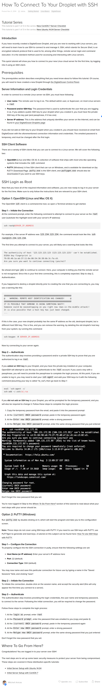

* Here is a tutorial from DigitalOcean about how to connect SSH keys from your local computer to your DigitalOcean droplet, [https://www.digitalocean.com/community/tutorials/how-to-connect-to-your-droplet-with-ssh/](https://www.digitalocean.com/community/tutorials/how-to-connect-to-your-droplet-with-ssh/).
* Here is the full screenshot.

