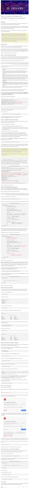

* Here is step by step on how to create a self signed certificate, [https://www.digitalocean.com/community/tutorials/how-to-create-a-self-signed-ssl-certificate-for-apache-in-ubuntu-16-04/](https://www.digitalocean.com/community/tutorials/how-to-create-a-self-signed-ssl-certificate-for-apache-in-ubuntu-16-04/).
* There are 2 different ways on how to make certificate. And that is depending on whether or not you are using domain name. In this case I do not need domain name.
* Here is the full screenshot of the tutorial.

