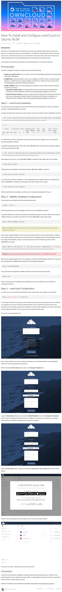

* Here is a step by step guide on how to install OwnCloud manually in DigitalOcean droplet using Ubuntu 16.04 LTS, [https://www.digitalocean.com/community/tutorials/how-to-install-and-configure-owncloud-on-ubuntu-16-04/](https://www.digitalocean.com/community/tutorials/how-to-install-and-configure-owncloud-on-ubuntu-16-04/).
* I think this tutorial will work on non droplet Ubuntu 16.04 as well.
* DigitalOcean provide an auto installation for OwnCloud as well. So you can just install Ubuntu 14.04 droplet with OwnCloud pre installed. However, aside from not using the latest version of OwnCloud and Ubuntu, I choose to install manually so that I can learn from the process.
* Here is the full screenshot of the tutorial.

