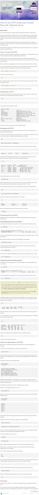

* Here is a tutorial on how to use SFTP server from DigitalOcean, [https://www.digitalocean.com/community/tutorials/how-to-use-sftp-to-securely-transfer-files-with-a-remote-server/](https://www.digitalocean.com/community/tutorials/how-to-use-sftp-to-securely-transfer-files-with-a-remote-server/).
* SFTP is like SSH connection but to transfer files.
* Here is the full screenshot of the tutorial.

