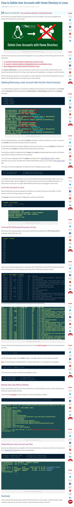

* Tutorial on how to delete user account and home folder in Linux, [http://www.tecmint.com/delete-remove-a-user-account-with-home-directory-in-linux/](http://www.tecmint.com/delete-remove-a-user-account-with-home-directory-in-linux/).
* Here is the screenshot of the tutorial.

