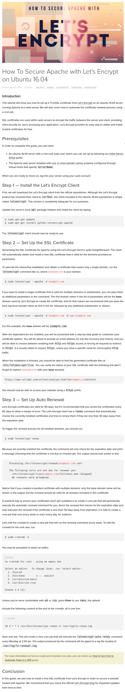

* Here is a tutorial about how to safe Apache server using Let's Encrypt, [https://www.digitalocean.com/community/tutorials/how-to-secure-apache-with-let-s-encrypt-on-ubuntu-16-04](https://www.digitalocean.com/community/tutorials/how-to-secure-apache-with-let-s-encrypt-on-ubuntu-16-04).
* This tutorial is listed in case I am using my own domain instead of public IP address for accessing DigitalOcean droplet.
* Here is the screenshot.

