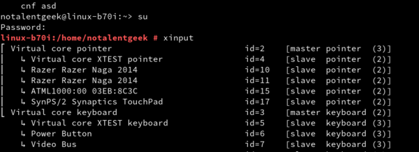

* Here is an example of using `xinput` to disable touch screen in my Lenovo Yoga laptop.
* The `Virtual core XTEST pointer` is the touch screen. If I disable it, the touch screen will also off.

* I suggested that turning off the touch screen will reduce the amount of Linux operating system to crash in my Lenovo Yoga laptop, but I was wrong.
* I feel that everytime I installed Linux that has a touch screen support my computer/laptop often crash. I hope I can uninstall the touchscreen driver.