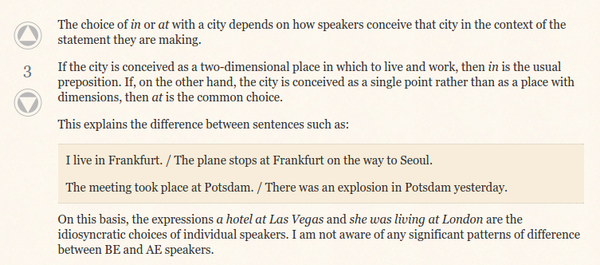

* I was wondering whether to use "at" or "in" for city name.
* The solution is rather simple. If it refer to point then use "at" (1 dimensional).
* However, if the city name refer as a place (for example, place to live, or place to do anything) then use "in" (3 dimensional).
* Right now I was wondering if these apply.
	* Use "at" for reference to a 1 dimensional (point).
	* Use "in" for reference to a 3 dimensional (you/something/the subject is inside the thing).
	* Use "on" for reference to a 2 dimensional (for example you are on a street, as street as in 2 dimension).
* Here is the discussion link, [http://english.stackexchange.com/questions/124755/at-vs-in-followed-by-a-city-name](http://english.stackexchange.com/questions/124755/at-vs-in-followed-by-a-city-name).
* Here, below, is the screenshot to the discussion.

