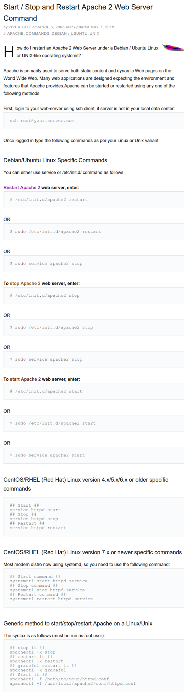

* This is a web page article that tells what terminal commands to start, stop, and restart Apache2 server, [http://www.cyberciti.biz/faq/star-stop-restart-apache2-webserver/](http://www.cyberciti.biz/faq/star-stop-restart-apache2-webserver/).
* The terminal command are these.
    * `sudo /etc/init.d/apache2 restart`.
    * `sudo /etc/init.d/apache2 start`.
    * `sudo /etc/init.d/apache2 stop`.
* The full screenshot is here.

