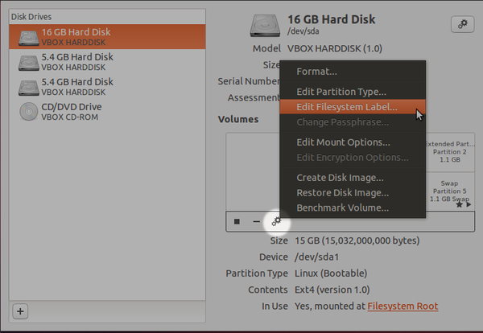

* Changing partition in Ubuntu can be done using GParted (Linux's signature application to edit and manager partition) or using Ubuntu default Disks application.
* Based on this discussion, [http://askubuntu.com/questions/276911/how-to-rename-partitions](http://askubuntu.com/questions/276911/how-to-rename-partitions). The easiest way is using the Disk application that is stock application from Ubuntu.

