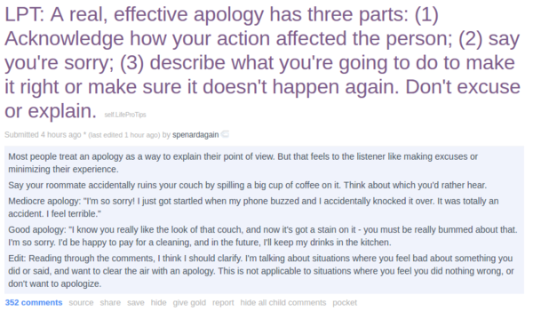

* This article is a thread on Reddit here, [https://www.reddit.com/r/LifeProTips/comments/58hw8h/lpt_a_real_effective_apology_has_three_parts_1/](https://www.reddit.com/r/LifeProTips/comments/58hw8h/lpt_a_real_effective_apology_has_three_parts_1/).
* To sum up.
    * Acknowledge that your action affected the victim(s).
    * Say sorry.
    * Describe what I am going to do to make it not happening again.
* Full screenshot of the thread is below.

