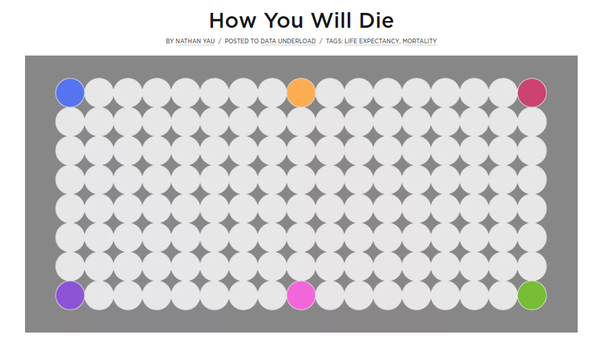

* There this web page that display a good visualization based on data on how a person will die, [http://flowingdata.com/2016/01/19/how-you-will-die/](http://flowingdata.com/2016/01/19/how-you-will-die/).
* One thing to notice is that the visualization is done beautifully using web technology (I suggest this is done using D3JS).
* The website here [http://flowingdata.com/](http://flowingdata.com/), also has some guides and tutorials on how to make visualization.

