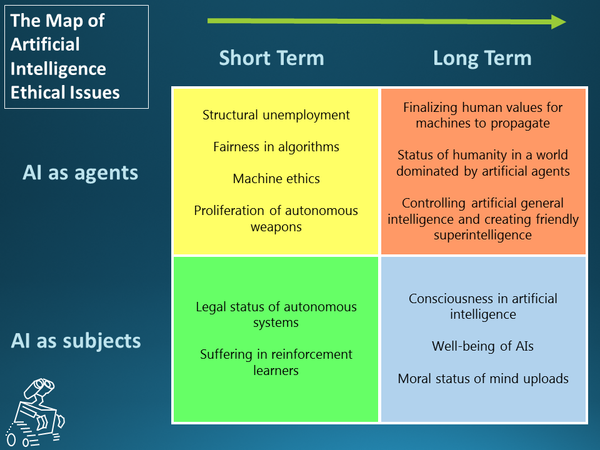

* Here are some ethical AI issues.
* I think I took this image from Reddit.
* I am not sure yet what are the meaning of AI as subject and AI as agent.
    * I think AI as agent means AI as it is viewed by people (human).
    * While AI as subject is about the AI itself. Like AI ethics of AI itself.
* Here is the screenshot.

