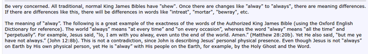

* I was wondering what are the differences between "alway" and "always".
* From this web page, [http://av1611.com/forums/showthread.php?t=943](http://av1611.com/forums/showthread.php?t=943).
* Especially in bible, "alway" is followed by form of exactness.
    * "Alway" means that it is like that at every time. For example "God alway love you."
    * While "always" means that it is like that at every interval. For example "I always go to school every weekdays."
* Here is the screenshot from the bible forum.

* However, after looking here, [http://www.thefreedictionary.com/alway](http://www.thefreedictionary.com/alway).
* "Alway" is the same as "always" in term of meaning. But "alway" is used in religious term.
* So for everyday English always (:D) use "always".