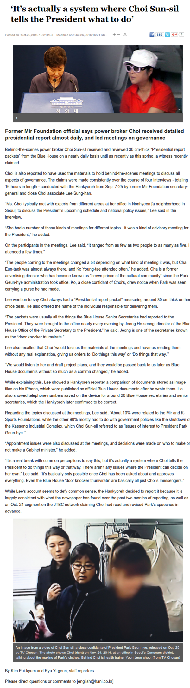
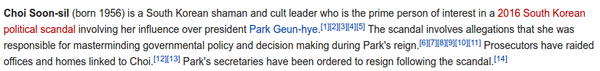

* There this information about a South Korean super broker is actually controlling South Korean government by marionetting the legitimate president.
* The name of the power broker mentioned here is Choi Sun-sil a woman.
* Quoted from this article "There are not many issues that the president can decide on her own.".
* Here is the article, [http://english.hani.co.kr/arti/english_edition/e_national/767405.html](http://english.hani.co.kr/arti/english_edition/e_national/767405.html).
* Screenshot of the article.

* Additionally, Cho Sun-sil is a actually a shamanic cult leader. I think this is similar to scientologist. Here is link to her Wikipedia pages, [https://en.wikipedia.org/wiki/Choi_Soon-sil](https://en.wikipedia.org/wiki/Choi_Soon-sil).
* Screenshot.

