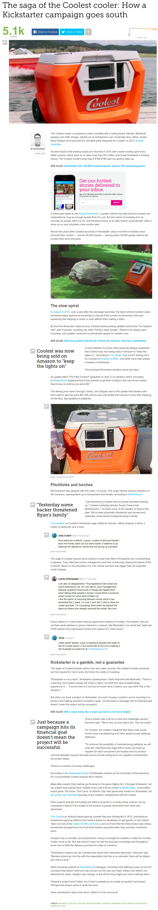

* There is this article from Mashable that tells story about successful KickStarter funding that is then failed when delivering the tool, [http://mashable.com/2016/04/16/coolest-cooler-money/#fMZN__JcHaqq](http://mashable.com/2016/04/16/coolest-cooler-money/#fMZN__JcHaqq).
* The main problem with KickStarter is that sometimes the author has a great idea, capable of realizing it, but do not have experience on mass production.
* Knowledge to do mass production is a necessity before starting KickStarter campaign.
* Here is the full screenshot of the article.

