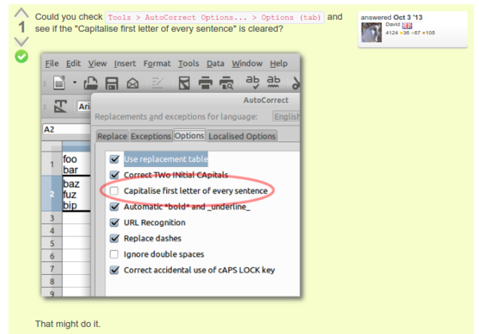

* Here is the screenshot that tells you how to disable auto capitalization in Libre Office calc.

* I found the solution from this discussion, [https://ask.libreoffice.org/en/question/23505/disable-auto-capitalization-in-multi-line-text-cells/](https://ask.libreoffice.org/en/question/23505/disable-auto-capitalization-in-multi-line-text-cells/).