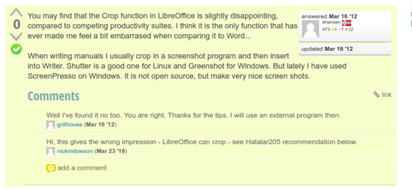

* Here is how to crop picture inside LibreOffice Writer environment, [https://ask.libreoffice.org/en/question/1256/crop-pictures-in-writer/](https://ask.libreoffice.org/en/question/1256/crop-pictures-in-writer/).
* The person here suggested to the crop image before used in LibreOffice Writer.
* However, I found that the basic crop feature in LibreOffice writer works fine. So, at least the feature works for my need, I do not need to crop the picture with another application.
* You can crop image in LibreOffice Writer by right clicking the image and then choose "Crop Image".
* Here is the screenshot I took from the discussion.

